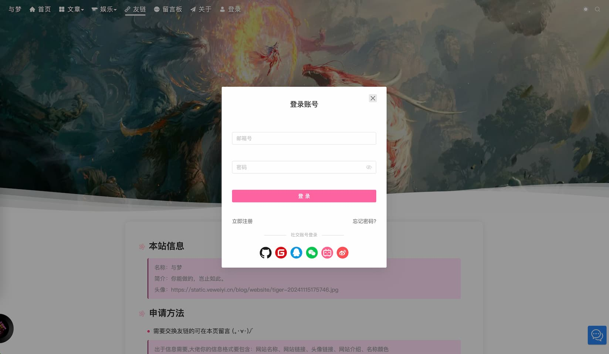
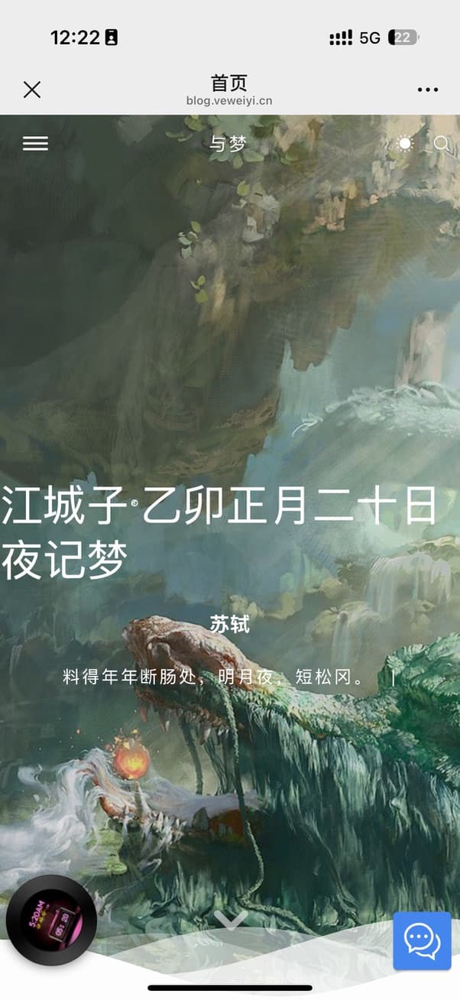
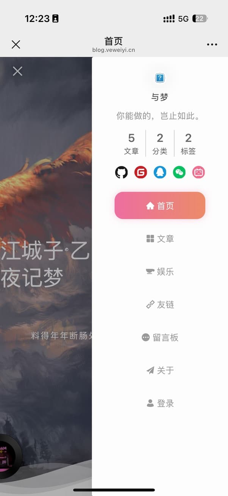
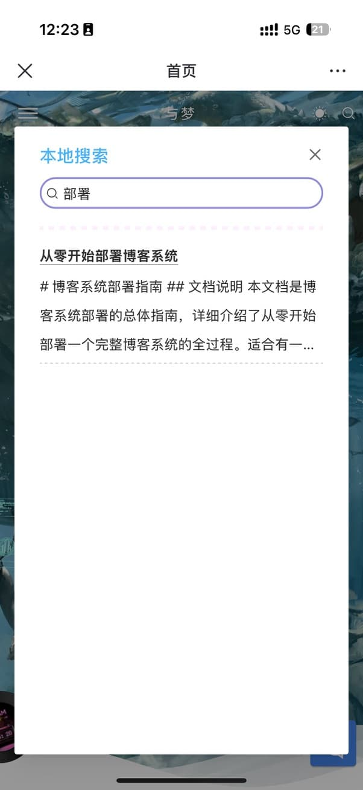
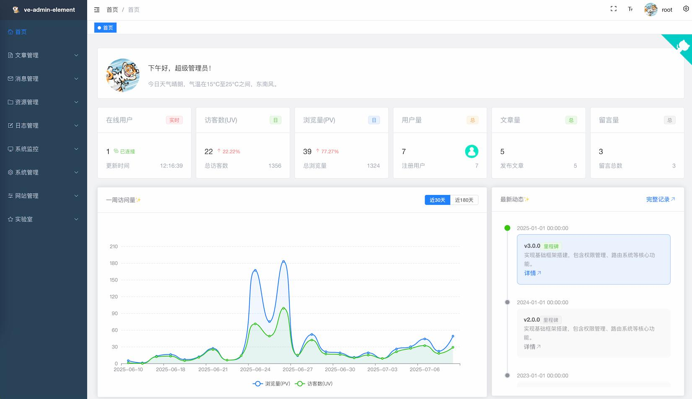
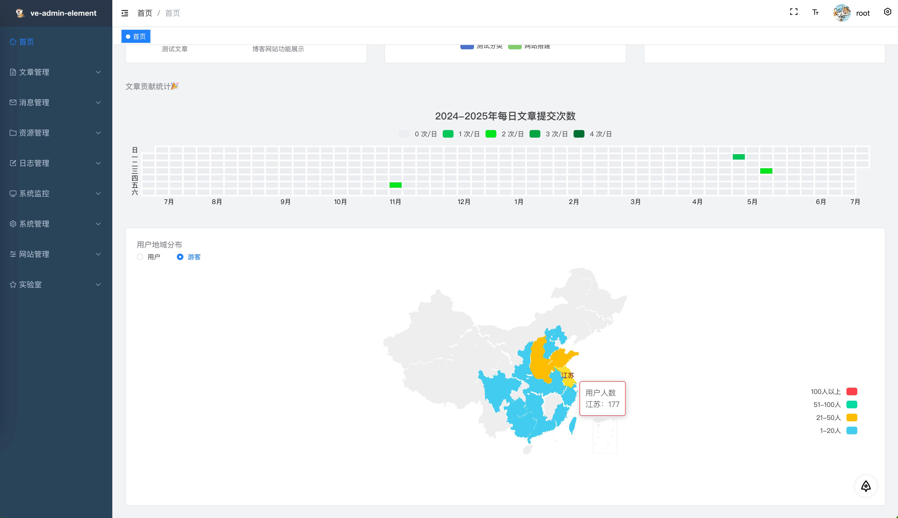

<div align=center>

  <h1>ve-blog-golang</h1>
  <p>🚀 基于 Go-Zero 微服务架构的现代化博客系统</p>


</div>


<div align="center">
  <a target="_blank" href="https://blog.veweiyi.cn">🖥️ 前台在线预览</a> |
  <a target="_blank" href="https://blog.veweiyi.cn/blog-api/v1/swagger/index.html">📑 前台接口文档</a>
</div>

<div align="center">
  <a target="_blank" href="https://admin.veweiyi.cn">🖥️ 后台在线预览</a> |
  <a target="_blank" href="https://admin.veweiyi.cn/admin-api/v1/swagger/index.html">📑 后台接口文档</a>
</div>


## 📚 项目简介

ve-blog 是一个功能完善的现代化全栈博客系统，后端采用 Go 语言 + Go-Zero 微服务架构，前端使用 Vue3 + TypeScript
技术栈。系统支持多种登录方式、RBAC 权限管理、文章管理、社交互动等丰富功能，提供完整的企业级博客解决方案。

### ✨ 核心亮点

- 🏗️ **微服务架构** - 基于 Go-Zero 框架，支持服务注册发现、负载均衡、熔断降级
- ⚡ **高性能** - Redis 缓存 + 消息队列优化，轻松应对高并发场景
- 🔐 **安全可靠** - JWT 认证、RBAC 权限控制、数据加密，全方位安全保障
- 🎨 **功能丰富** - 文章管理、社交互动、数据统计、实时聊天等完整功能
- 🛠️ **开发友好** - 代码生成工具、Swagger 文档、模块化设计，快速开发
- 🐳 **一键部署** - Docker Compose 编排，简化部署流程

## 📸 项目预览

✨  **博客网站**




📲 **移动端**

|                              |                              |                              |
|------------------------------|------------------------------|------------------------------|
|  |  |  |

🖥️ **控制台**





## 🛠️ 技术栈

### 后端技术

| 技术       | 说明     | 版本     |
|----------|--------|--------|
| Go       | 编程语言   | 1.20+  |
| Go-Zero  | 微服务框架  | 1.5.3  |
| Gin      | Web 框架 | 1.9.0  |
| Gorm     | ORM 框架 | 1.24.7 |
| gRPC     | RPC 框架 | -      |
| MySQL    | 关系型数据库 | 8.0+   |
| Redis    | 缓存数据库  | 6.2+   |
| RabbitMQ | 消息队列   | -      |
| Kafka    | 消息队列   | -      |
| JWT      | 身份认证   | -      |
| Swagger  | API 文档 | 1.5.3  |

### 前端技术

| 技术           | 说明                |
|--------------|-------------------|
| Vue3         | 渐进式 JavaScript 框架 |
| TypeScript   | JavaScript 超集     |
| Pinia        | 状态管理              |
| Element Plus | 后台 UI 组件库         |
| Naive UI     | 前台 UI 组件库         |
| Vite         | 构建工具              |

## 🎯 系统功能

### 👤 用户系统

- 多种登录方式：账号密码、GitHub、QQ、微信等第三方登录
- 用户信息管理、头像上传、个人资料编辑
- 在线用户统计、用户行为追踪

### 🔐 权限管理

- 基于 RBAC 的权限模型
- 动态权限配置、菜单管理、路由控制
- 角色管理、用户角色绑定

### 📝 内容管理

- Markdown 编辑器，支持图片上传
- 文章分类、标签管理
- 文章评论、点赞、收藏
- 文章搜索、推荐算法

### 💬 社交互动

- 说说动态发布
- 友情链接管理
- 相册管理
- 留言弹幕墙
- 音乐播放器
- WebSocket 实时聊天室（Stomp 协议）

### 📊 数据统计

- 访问量统计（PV/UV）
- 用户活跃度分析
- 文章阅读量排行
- 数据可视化大屏

### 🔔 消息通知

- 评论回复邮件提醒
- 系统消息推送
- 站内信通知

## 📁 项目源码

| 项目               | 功能     | Github                                                               | Gitee                                                               |
|------------------|--------|----------------------------------------------------------------------|---------------------------------------------------------------------|
| ve-blog-golang   | 博客后端服务 | [ve-blog-golang](https://github.com/ve-weiyi/ve-blog-golang.git)     | [ve-blog-golang](https://gitee.com/ve-weiyi/ve-blog-golang.git)     |
| ve-blog-naive    | 博客前台展示 | [ve-blog-naive](https://github.com/ve-weiyi/ve-blog-naive.git)       | [ve-blog-naive](https://gitee.com/ve-weiyi/ve-blog-naive.git)       |
| ve-admin-element | 博客后台管理 | [ve-admin-element](https://github.com/ve-weiyi/ve-admin-element.git) | [ve-admin-element](https://gitee.com/ve-weiyi/ve-admin-element.git) |

## 🏗️ 项目结构

```
ve-blog-golang/
├── blog-gin/              # Gin 框架实现（示例参考）
├── blog-gozero/           # Go-Zero 微服务实现（主要实现）
│   ├── service/
│   │   ├── api/          # API 网关层
│   │   │   ├── blog/     # 前台接口服务
│   │   │   └── admin/    # 后台接口服务
│   │   └── rpc/          # RPC 服务层
│   │       └── blog/     # 业务逻辑服务
│   ├── model/            # 数据模型
│   └── common/           # 公共模块
├── kit/                   # 通用工具包
│   ├── utils/            # 工具函数
│   ├── middleware/       # 中间件
│   └── infra/            # 基础设施
├── stompws/              # WebSocket 聊天室（Stomp 协议）
├── tools/                # 代码生成工具
└── deploy/               # 部署配置文件
    ├── docker/           # Docker 配置
    └── k8s/              # Kubernetes 配置
```

## ⚙️ 环境要求

### 必需环境

- **Go**: 1.20 或更高版本
- **MySQL**: 8.0 或更高版本
- **Redis**: 6.2 或更高版本
- **Node.js**: 16+ (前端项目)
- **pnpm**: 8+ (前端包管理)

### 可选环境

- **Docker**: 20.10+ (容器化部署)
- **Docker Compose**: 2.0+ (服务编排)
- **RabbitMQ**: 3.9+ (消息队列)
- **Kafka**: 2.8+ (消息队列)

### 推荐开发工具

- **IDE**: GoLand / VS Code
- **数据库管理**: Navicat / DBeaver
- **Redis 管理**: Another Redis Desktop Manager
- **API 测试**: Postman / Apifox
- **容器管理**: Docker Desktop

## 🚀 快速开始

### **运行接口服务**
```bash
# 克隆项目
git clone https://github.com/ve-weiyi/ve-blog-golang.git

# 进入项目目录
cd ve-blog-golang/blog-gozero

# 安装 Go 依赖
go mod tidy

# 启动 RPC 服务
go run service/rpc/blog/blog.go -f service/rpc/blog/etc/blog.yaml

# 启动前台 API 服务
go run service/api/blog/blog.go -f service/api/blog/etc/blog.yaml

# 启动后台 API 服务
go run service/api/admin/admin.go -f service/api/admin/etc/admin.yaml
```

### **运行前端服务**

**运行前台服务**

```bash
# 克隆项目
git clone https://github.com/ve-weiyi/ve-blog-navie.git

# 进入项目目录
cd ve-blog-naive

# 安装依赖
pnpm install

# 启动运行
pnpm run dev
```

**运行后台服务**

```bash
# 克隆项目
git clone https://github.com/ve-weiyi/ve-admin-element.git

# 进入项目目录
cd ve-admin-element

# 安装依赖
pnpm install

# 启动运行
pnpm run dev
```

### 访问系统

| 服务        | 地址                                                    | 说明         |
|-----------|-------------------------------------------------------|------------|
| 前台网站      | http://localhost:9420                                 | 博客前台展示     |
| 后台管理      | http://localhost:9421                                 | 博客后台管理     |
| 前台 API 文档 | http://localhost:9090/blog-api/v1/swagger/index.html  | Swagger 文档 |
| 后台 API 文档 | http://localhost:9091/admin-api/v1/swagger/index.html | Swagger 文档 |

## Docker 部署（可选）

```bash
# 使用 Docker Compose 一键启动
cd deploy/docker
docker-compose up -d
```

## 📈 开发路线

### 已完成 ✅

- [x] Swagger API 文档
- [x] Go-Zero 微服务架构搭建
- [x] 用户认证与授权系统
- [x] RBAC 权限管理
- [x] 文章管理系统
- [x] WebSocket 实时聊天室（Stomp 协议）

### 进行中 🚧

- [ ] 用户评论邮件提醒功能
- [ ] 性能监控优化

### 计划中 📋

- [ ] 集成 ElasticSearch 全文搜索
- [ ] 添加 Prometheus + Grafana 监控
- [ ] 集成 AI 聊天功能（ChatGPT）
- [ ] 支持 Kubernetes 部署
- [ ] 增加更多社交互动功能

## 🤝 参与贡献

欢迎提交 Issue 和 Pull Request！您的参与将帮助我们打造更好的博客系统。

1. Fork 本仓库
2. 创建功能分支：`git checkout -b feature/your-feature`
3. 提交更改：`git commit -m 'Add some feature'`
4. 推送到分支：`git push origin feature/your-feature`
5. 提交 Pull Request

请遵循 [Conventional Commits](https://www.conventionalcommits.org/) 规范：

- `feat`: 新功能
- `fix`: 修复 Bug
- `docs`: 文档更新
- `style`: 代码格式调整
- `refactor`: 代码重构
- `test`: 测试相关
- `chore`: 构建/工具链相关

## 📄 开源协议

本项目基于 [MIT License](LICENSE) 开源协议，可自由使用、修改和分发。

## 🙏 致谢

感谢以下优秀开源项目的启发和参考：

- [风丶宇的博客](https://github.com/X1192176811/blog) - 项目灵感来源
- [阿冬的个人博客](https://github.com/ttkican/Blog) - UI 设计参考
- [vue3-element-admin](https://github.com/youlaitech/vue3-element-admin) - 后台管理参考
- [Go-Zero](https://github.com/zeromicro/go-zero) - 微服务框架

## 💬 联系作者

如果你在使用过程中遇到问题，欢迎通过以下方式联系作者，很很乐意解答您的问题：

- 📧 **提交 Issue**: [GitHub Issues](https://github.com/ve-weiyi/ve-blog-golang/issues)
- 💬 **QQ**: 791422171
- 📱 **微信**: wy791422171

## ⚠️ 注意事项

- 本项目为个人学习项目，持续更新中
- 生产环境使用请充分测试
- `feature` 分支可能会强制推送，请以 `main/master` 分支为准
- 欢迎 Star ⭐ 支持，感谢关注！

---

<div align="center">
  <p>如果这个项目对你有帮助，请给个 ⭐ Star 支持一下！</p>
  <p>Made with ❤️ by <a href="https://github.com/ve-weiyi">ve-weiyi</a></p>
</div>
