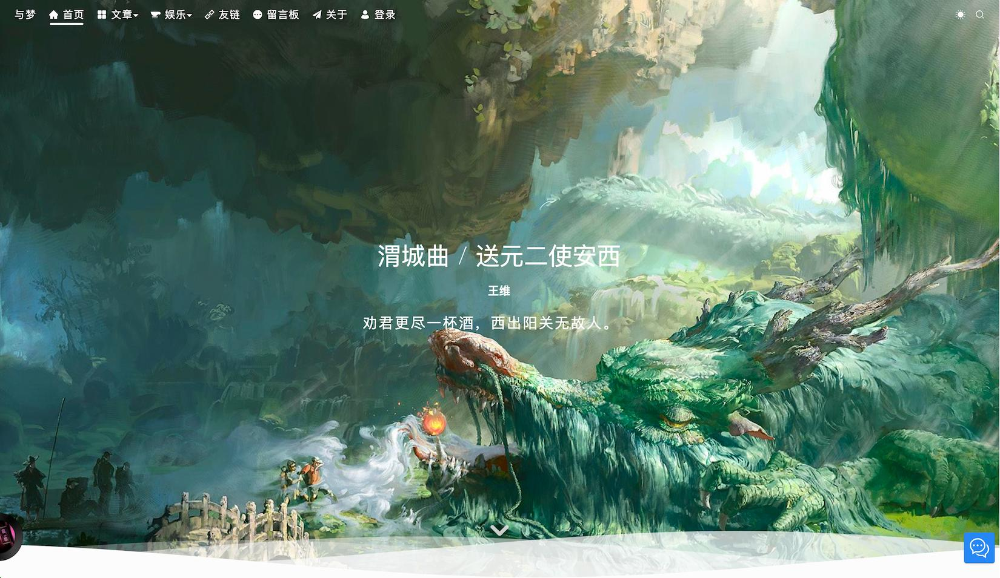

<div align=center>

  <h1>ve-blog-golang</h1>


</div>


<div align="center">
  <a target="_blank" href="https://blog.veweiyi.cn">🖥️ 前台在线预览</a> |
  <a target="_blank" href="https://blog.veweiyi.cn/blog-api/v1/swagger/index.html">📑 前台接口文档</a> |
</div>

<div align="center">
  <a target="_blank" href="https://admin.veweiyi.cn">🖥️ 后台在线预览</a> |
  <a target="_blank" href="https://admin.veweiyi.cn/admin-api/v1/swagger/index.html">📑 后台接口文档</a>
</div>


## 📚 项目简介

ve-blog 是一个现代化的全栈博客系统，采用 Go 语言开发后端，基于微服务架构，提供完整的博客解决方案。

## 项目预览

### 1. 项目截图



## ✨ 核心特性

### 1. 技术栈

- **后端**：Golang + Go-zero + gRPC + Gorm + Redis + RabbitMQ + Kafka
- **前端**：Vue3 + Pinia + TypeScript + Element Plus + Naive UI
- **部署**：Docker Compose 一键部署

### 2. 系统功能

- **用户系统**：支持账号密码、Github、QQ、微信等多种登录方式
- **权限管理**：基于 RBAC 的权限模型，支持动态权限、菜单和路由
- **文章管理**：支持 Markdown 编辑器、文章分类、标签、评论、点赞
- **社交功能**：说说、友链、相册、留言弹幕墙、音乐播放器、聊天室
- **消息通知**：评论回复邮件提醒、系统消息推送

### 3. 技术亮点

- **微服务架构**：采用 go-zero 框架，支持服务注册发现、负载均衡，实现高可用架构
- **高性能**：使用 Redis 缓存、消息队列优化，支持高并发访问，轻松应对流量高峰
- **安全性**：JWT 认证、数据加密、权限控制，全方位保障系统安全
- **可扩展性**：模块化设计，支持功能扩展和定制，满足个性化需求
- **开发效率**：提供完整的代码生成工具，快速开发新功能

## 📁 项目源码

| 项目               | 功能     | Github                                                               |
|------------------|--------|----------------------------------------------------------------------|
| ve-blog-golang   | 博客后端服务 | [ve-blog-golang](https://github.com/ve-weiyi/ve-blog-golang.git)     |
| ve-blog-naive    | 博客前台展示 | [ve-blog-naive](https://github.com/ve-weiyi/ve-blog-naive.git)       |
| ve-admin-element | 博客后台管理 | [ve-admin-element](https://github.com/ve-weiyi/ve-admin-element.git) |

## 🏗️ 项目结构

```
ve-blog-golang/
├── blog-gin/         # Gin 框架实现（示例）
├── blog-gozero/      # Go-zero 微服务实现
├── kit/              # 通用工具包
├── tools/            # 代码生成工具
└── deploy/           # 部署配置
```

## ⚙️ 环境要求

- Go 1.20+
- MySQL 8.0+
- Redis 6.2+
- Docker & Docker Compose

## 🔧 开发工具

- IDE: Intellij IDEA Ultimate
- 数据库: Navicat
- Redis: Another Redis Desktop Manager
- 容器: Docker Desktop

## 🛠️ 快速开始

### 项目启动

运行接口服务
```bash
# 克隆项目
git clone https://github.com/ve-weiyi/ve-blog-golang.git

# 进入项目目录
cd ve-blog-golang/blog-gozero

# 安装依赖
go mod tidy

# 启动rpc服务
go run service/rpc/blog/blog.go -f service/rpc/blog/etc/blog.yaml

# 启动前台接口服务
go run service/api/blog/blog.go -f service/api/blog/etc/blog.yaml

# 启动后台接口服务
go run service/api/admin/admin.go -f service/api/admin/etc/admin.yaml
```

运行前台服务

```bash
# 克隆项目
git clone https://github.com/ve-weiyi/ve-blog-navie.git

# 进入项目目录
cd ve-blog-naive

# 安装依赖
pnpm install

# 启动运行
pnpm run dev
```

运行后台服务

```bash
# 克隆项目
git clone https://github.com/ve-weiyi/ve-admin-element.git

# 进入项目目录
cd ve-admin-element

# 安装依赖
pnpm install

# 启动运行
pnpm run dev
```

- 前台接口地址：`http://localhost:9090/blog-api/v1/swagger/index.html`
- 后台接口地址：`http://localhost:9091/admin-api/v1/swagger/index.html`
- 前台服务地址：`http://localhost:9420`
- 后台服务地址：`http://localhost:9421`

## 📈 后续计划

- [ ] 用户评论邮件提醒
- [ ] 集成 ElasticSearch 搜索引擎
- [ ] 添加 Prometheus 监控
- [ ] 集成 ChatGPT 聊天功能
- [ ] 优化性能监控
- [ ] 增加更多社交功能

## 🤝 参与贡献

欢迎提交 Issue 和 Pull Request，一起完善项目！您的参与将帮助我们打造更好的博客系统。

1. Fork 本仓库
2. 创建功能分支：`git checkout -b feature/your-feature`
3. 提交更改：`git commit -m 'Add some feature'`
4. 推送到分支：`git push origin feature/your-feature`
5. 提交 Pull Request

## 📄 开源协议

本项目采用 MIT 协议开源，请遵守开源协议。

## 🙏 致谢

感谢以下项目的启发：

- [风丶宇的博客(已删库)](https://github.com/X1192176811/blog)
- [阿冬的个人博客](https://github.com/ttkican/Blog)
- [vue3-element-admin](https://github.com/youlaitech/vue3-element-admin)

## 其他

### 作者联系方式：

* qq 791422171
* 微信 wy791422171

### 作者留言

- 遇到问题可以提 issue，在运行或者搭建过程中遇到问题可以加我好友，很乐意解答。
- 工作之余持续更新，持续学习新技术。个人项目，写着玩的。
- 注意！！作者经常强制推送feature分支，会覆盖提交。以master分支功能为准。分支功能和版本发布规则见[VERSION.md](VERSION.md)
