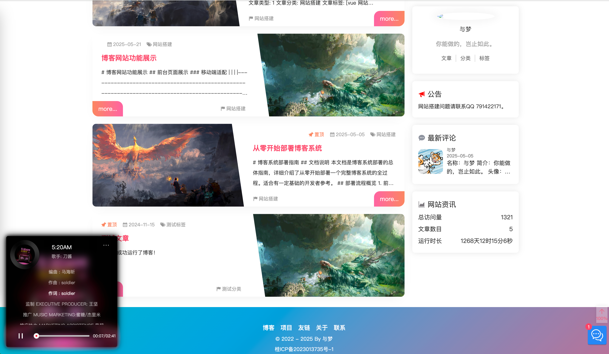

联系方式：qq 791422171

练手项目，兴趣是第一驱动力。工作之余持续更新，持续学习新技术。

# 博客介绍

## 基本介绍
ve-blog 是一个前后端分离的博客系统，项目采用了前后端分离的架构进行开发。前后端通过RESTful API进行数据交互。

+ 项目演示

前台链接： https://blog.veweiyi.cn

后台链接： https://admin.veweiyi.cn

测试账号： admin@qq.com 密码：admin@qq.com

+ 接口文档

接口文档： 

https://blog.veweiyi.cn/api/v1/swagger/index.html  

https://admin.veweiyi.cn/admin_api/v1/swagger/index.html

+ 仓库地址

博客展示前台仓库地址: https://github.com/ve-weiyi/ve-blog-naive.git

博客管理后台仓库地址: https://github.com/ve-weiyi/ve-admin-element.git

博客后端服务仓库地址: https://github.com/ve-weiyi/ve-blog-golang.git

## 技术介绍

前端： Vue3 + Pinia + Vue Router + TypeScript + Axios + Element Plus + Naive UI + Echarts + Swiper

后端： Golang + Go-zero + gRPC + Gorm + Redis + RabbitMQ + Kafka + Nacos + Cobra + JWT + Swagger

其他：邮件服务、chatgpt服务、代码生成工具。

## 项目特点
* 前后端分离，Docker Compose 一键部署。
* 使用 go-zero 框架开发，支持 grpc 服务间通信。实现健康检测、链路追踪、熔断降级、限流等功能。
* 采用 RABC 权限模型，使用 jwt-Token 进行权限管理。
* 登录模块：接入第三方登录，减少注册成本。可以使用 Github、QQ、微信 快速登录。    
* 权限模块：支持动态权限修改、动态菜单和路由。可以对用户和角色进行权限管理，可以对菜单权限、接口权限进行权限控制。
* 文章模块：发布文章、置顶文章、文章分类、文章标签、文章评论、文章点赞。
* 评论模块：发布评论、回复评论、评论点赞、表情包，评论回复邮件提醒。
* 说说、友链、相册、留言弹幕墙、音乐播放器、聊天室。
* 文章编辑使用 Markdown 编辑器。
* 提供了接口文档。通过导入swagger.json可以在apifox和postman查看和调试接口。

## 运行环境
服务器： 腾讯云 2核4G CentOS7.6

服务器最低配置： 2核2G （关闭 ElasticSearch）

对象存储： 七牛云

## 开发环境
基于Mac系统，开发工具如下：

| 开发工具                          | 说明             | 地址                                                    |
|-------------------------------|----------------|-------------------------------------------------------|
| Intellij IDEA Ultimate        | Go、Vue 开发工具IDE |                                                       |
| Navicat                       | MySQL 远程连接工具   |                                                       |
| Another Redis Desktop Manager | Redis 远程连接工具   | https://github.com/qishibo/AnotherRedisDesktopManager |
| Docker Desktop                | Docker 管理工具    |                                                       |

## 项目目录

+ [assets](assets) 存放项目图片、文章等资源。
+ [deploy](deploy) 存放项目部署相关的文件，通过 docker-compose 快速部署服务。

+ [blog-gin](blog-gin) 使用 [gin](https://github.com/gin-gonic/gin) 开发的博客后端服务。
  gin框架的优点是轻量、快速、易用，适合快速开发API接口，适用于golang后端初学者。  
  由于修改接口定义时维护麻烦，在v3.0.0之后删除了具体的实现逻辑，只保存了接口定义，具体实现请看go-zero框架。

+ [blog-gozero](blog-gozero) 使用 [go-zero](https://github.com/zeromicro/go-zero) 开发的博客后端服务。
  go-zero框架的优点是功能齐全，自带了多种中间件，适合大型项目和复杂业务的解耦。
  使用grpc进行服务间通信，使用etcd进行服务注册和发现，使用gorm进行数据库操作，使用jwt进行鉴权。

+ [kit](kit) 存放项目的golang工具包,一些通用的工具会放在这里。
+ [tools](tools) 通过cobra命令实现快速生成代码，功能类似于go-zero的goctl。

## 项目预览

## 后续计划
1. [x] 拆分rpc服务和api服务
2. [x] 添加Kafka消息队列
3. [ ] 添加ElasticSearch搜索引擎
4. [ ] 添加Prometheus监控
5. [ ] 添加ChatGPT聊天

## 项目总结

感谢项目：

[阿冬的个人博客](https://github.com/ttkican/Blog)

[vue3-element-admin](https://github.com/youlaitech/vue3-element-admin)
