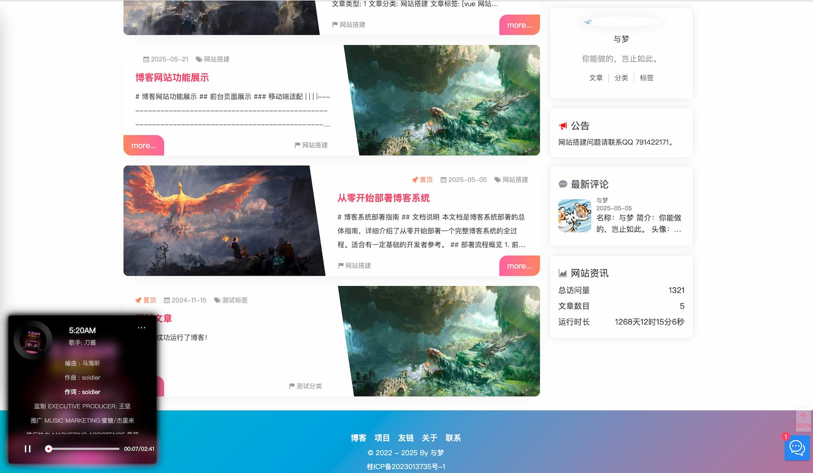
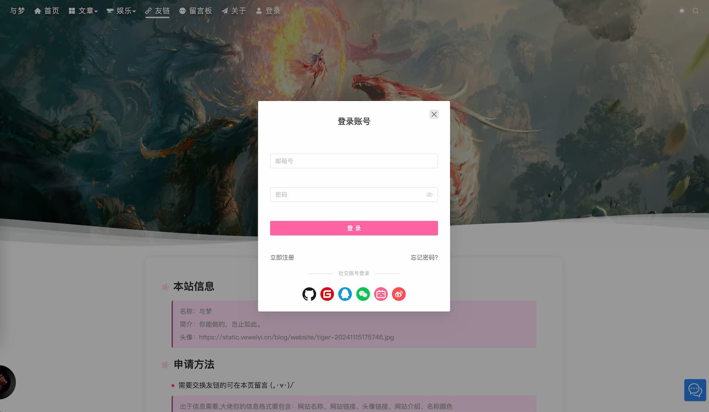
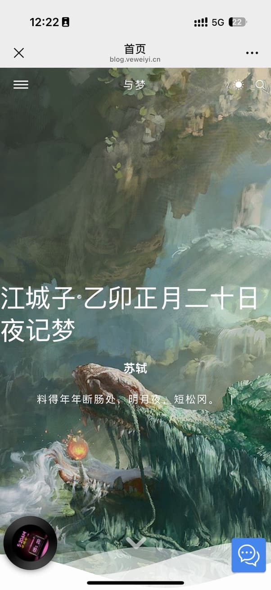
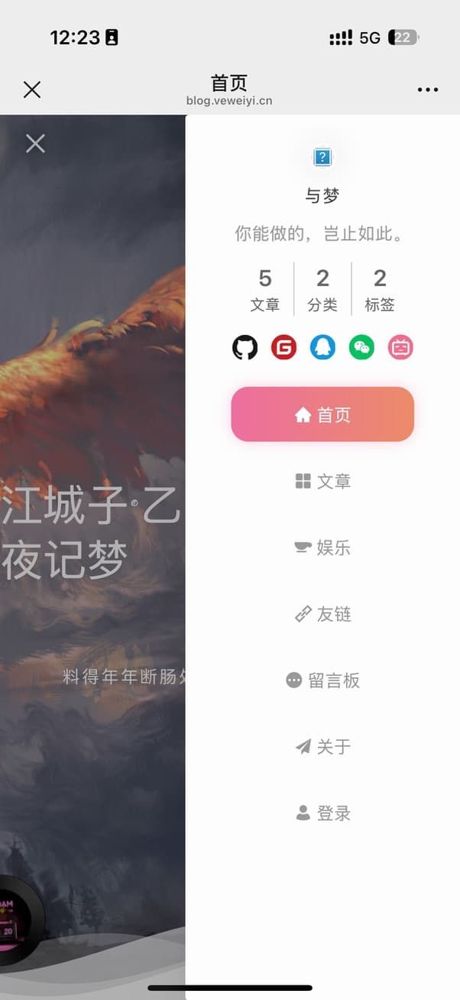
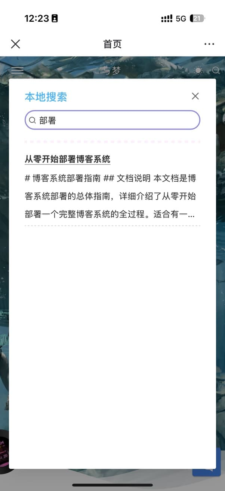
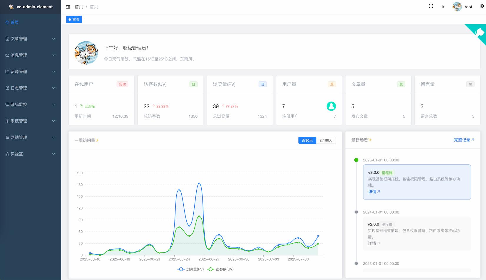
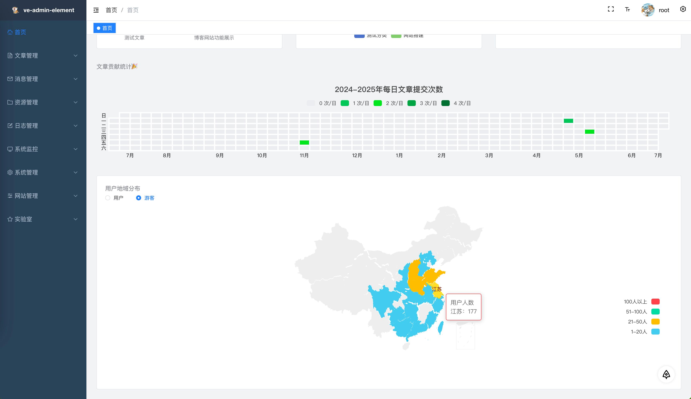

<div align="center">
  
  <h1>ve-blog-golang</h1>
  <p>🚀 基于 Go-Zero 微服务架构的现代化博客系统</p>

  
  
  
  
  
  
  
  
  


  <br/>

  <a target="_blank" href="https://blog.veweiyi.cn">
    
  </a>
  <a target="_blank" href="https://admin.veweiyi.cn">
    
  </a>
  <br/>
  <a target="_blank" href="https://blog.veweiyi.cn/api/v1/swagger/index.html">📑 前台 API 文档</a>
  &nbsp;|&nbsp;
  <a target="_blank" href="https://admin.veweiyi.cn/admin-api/v1/swagger/index.html">📑 后台 API 文档</a>
</div>

<br/>

## 📚 项目简介

ve-blog 是一个功能完善的现代化全栈博客系统，后端采用 Go + Go-Zero 微服务架构，前端使用 Vue 3 + TypeScript 技术栈。支持 OAuth2.0 多端登录、RBAC 权限管理、Markdown 文章编辑、WebSocket 实时聊天等丰富功能。

### ✨ 核心亮点

- 🚀 **5 分钟启动** — `make deps && make docker-deps` 一行命令拉起全部依赖，专注写业务代码
- 🌐 **完整工程化** — 前后台分离 + Swagger 文档 + 数据库脚本 + 部署配置，全套方案而非半成品
- 🎨 **功能开箱即用** — OAuth2.0 登录、Markdown 编辑、实时聊天、数据统计，拿来就用
- 📦 **开发到生产全覆盖** — Docker Compose 本地调试 → K8s + HPA 弹性伸缩，一套 Makefile 全搞定
- 🔧 **模块化低耦合** — Go-Zero 微服务分层，替换任何组件不影响全局，二次开发零风险
- 🛠️ **免文档化** — Swagger + gRPC 接口定义 + 清晰的目录分层，接手项目零学习成本

## 🏗️ 系统架构

```
                              ┌──────────────────────────┐
                              │   Nginx (veweiyi.cn)      │
                              │  ├─ blog.veweiyi.cn       │
                              │  └─ admin.veweiyi.cn       │
                              └────────────┬─────────────┘
                                           │ HTTP
                     ┌─────────────────────┼─────────────────────┐
                     │                     │                     │
              ┌──────▼──────┐       ┌──────▼──────┐       ┌──────▼──────┐
              │  blog-api    │       │  admin-api   │       │  WebSocket  │
              │  :9420       │       │  :9421       │       │  Stomp 聊天  │
              │  前台 API     │       │  后台 API     │       │  实时推送    │
              └──────┬──────┘       └──────┬──────┘       └─────────────┘
                     │  gRPC                │  gRPC
                     └──────────┬───────────┘
                                │
                     ┌──────────▼──────────┐
                     │    app-rpc  :9120    │
                     │    核心业务服务        │
                     │  ┌────────────────┐  │
                     │  │ 用户 · 权限 · RBAC│  │
                     │  │ 文章 · 评论 · 标签│  │
                     │  │ 说说 · 友链 · 相册│  │
                     │  │ 统计 · 通知 · 消息│  │
                     │  └────────────────┘  │
                     └──────────┬───────────┘
                                │
          ┌─────────────────────┼─────────────────────┐
          │                     │                     │
   ┌──────▼──────┐      ┌──────▼──────┐      ┌──────▼──────┐
   │    MySQL    │      │    Redis    │      │  RabbitMQ   │
   │    :3306    │      │    :6379    │      │    :5672    │
   └─────────────┘      └─────────────┘      └─────────────┘

   ┌──────────────┐     ┌──────────────┐
   │    Nacos     │     │     EFK      │
   │  配置/注册中心 │     │   日志收集    │
   └──────────────┘     └──────────────┘
```

## 📸 项目预览

✨ **博客网站**






📲 **移动端**

|                              |                              |                              |
|------------------------------|------------------------------|------------------------------|
|  |  |  |

🖥️ **控制台**





## 🛠️ 技术栈

### 后端

| 技术 | 说明 | 版本 |
|------|------|------|
| Go | 编程语言 | 1.25+ |
| Go-Zero | 微服务框架 | 1.10 |
| gRPC | RPC 框架 | 1.81 |
| GORM | ORM 框架 | 1.31 |
| MySQL | 关系型数据库 | 8.0+ |
| Redis | 缓存 | 6.2+ |
| RabbitMQ | 消息队列 | 3.9+ |
| Nacos | 配置中心 / 服务发现 | 2.x |
| JWT | 身份认证 | — |
| Swagger | API 文档 | — |

### 前端（独立仓库）

| 技术 | 说明 |
|------|------|
| Vue 3 | 渐进式框架 |
| TypeScript | 类型安全 |
| Pinia | 状态管理 |
| Element Plus | 后台 UI |
| Naive UI | 前台 UI |
| Vite | 构建工具 |

## 🎯 系统功能

| 模块 | 功能                                       | 状态 |
|------|------------------------------------------|:--:|
| 👤 用户系统 | OAuth2.0（GitHub / QQ / 微信）、账号密码登录、个人信息管理 | ✅ |
| 🔐 权限管理 | RBAC 权限模型、动态菜单路由、角色绑定、API 鉴权             | ✅ |
| ✍️ 内容管理 | Markdown 编辑器、分类标签、评论点赞、收藏搜索              | ✅ |
| 💬 社交互动 | 说说动态、友链管理、相册、留言弹幕、音乐、WebSocket+Stomp 聊天室 | ✅ |
| 📊 数据统计 | PV/UV 统计、用户活跃分析、阅读排行、操作日志                | ✅ |
| 🔔 消息通知 | 评论邮件提醒、系统推送、站内信                          | 🚧 |
| 🐳 容器部署 | Docker Compose 一键编排                      | ✅ |
| ☸️ K8s 部署 | Deployment + Ingress + HPA 弹性伸缩          | ✅ |
| 📝 日志收集 | EFK（Elasticsearch + Fluentd + Kibana）    | ✅ |

## 📁 项目源码

| 项目 | 说明 | 仓库 |
|------|------|------|
| ve-blog-golang | 博客后端（go-zero 微服务版） | [GitHub](https://github.com/ve-weiyi/ve-blog-golang) |
| ve-blog-gin | 博客后端（Gin 单体版） | [GitHub](https://github.com/ve-weiyi/ve-blog-gin) |
| ve-blog-naive | 博客前台 | [GitHub](https://github.com/ve-weiyi/ve-blog-naive) |
| ve-admin-element | 博客后台 | [GitHub](https://github.com/ve-weiyi/ve-admin-element) |

## 🏗️ 项目结构

```
ve-blog-golang/
├── service/
│   ├── app/
│   │   ├── api/              # 前台 API 服务
│   │   │   ├── docs/         # Swagger 文档
│   │   │   ├── etc/          # 配置文件
│   │   │   ├── internal/     # handler / logic / middleware
│   │   │   └── proto/        # API 接口定义 (.api)
│   │   ├── model/            # GORM 数据模型
│   │   └── rpc/              # 核心 RPC 服务 (gRPC)
│   │       ├── client/       # RPC 客户端
│   │       ├── etc/          # 配置文件
│   │       └── internal/     # logic / server / mq
│   └── admin/
│       └── api/              # 后台 API 服务
├── infra/                    # 基础设施（拦截器、中间件）
├── vkit/                     # 本地工具包
├── stompws/                  # WebSocket 聊天室（Stomp 协议）
├── goctlx/                   # 代码生成工具
├── deploy/
│   ├── docker/               # Dockerfile
│   ├── docker-compose/       # Docker Compose 编排
│   │   ├── mysql/            # MySQL
│   │   ├── redis/            # Redis
│   │   ├── rabbitmq/         # RabbitMQ
│   │   └── app/              # 应用服务
│   ├── k8s/                  # Kubernetes 部署
│   │   ├── app/              # 应用 Deployment + Ingress
│   │   ├── mysql/            # MySQL StatefulSet
│   │   ├── redis/            # Redis StatefulSet
│   │   ├── nacos/            # Nacos 配置中心
│   │   └── efk/              # EFK 日志收集
│   └── sql/                  # 数据库初始化脚本
├── Makefile                  # 开发/构建/部署一条龙
└── go.mod
```

## ⚙️ 环境要求

- **Go**: 1.25+
- **MySQL**: 8.0+
- **Redis**: 6.2+
- **Docker**: 20.10+（可选，容器化部署）
- **kubectl**: 1.28+（可选，K8s 部署）

## 🚀 快速开始

```bash
# 1. 克隆 & 安装依赖
git clone https://github.com/ve-weiyi/ve-blog-golang && cd ve-blog-golang
make deps

# 2. 启动依赖服务 (MySQL + Redis + RabbitMQ)
make docker-deps

# 3. 启动服务（三个终端，先 RPC 后 API）
make run-app-rpc       # 终端1: RPC 核心服务
make run-app-api       # 终端2: 前台 API → http://localhost:9420/api/v1/swagger/index.html
make run-admin-api     # 终端3: 后台 API → http://localhost:9421/admin-api/v1/swagger/index.html
```

## 🐳 部署

### Docker Compose

```bash
make docker-up     # 一键启动所有容器
make docker-down   # 停止所有容器
```

### Kubernetes

```bash
bash deploy/k8s/ssl/apply.sh   # 导入 SSL 证书（首次）
make k8s-up                    # 部署应用
make k8s-down                  # 移除
```

## 📋 常用命令

```bash
make help             # 查看所有命令

# 开发
make deps             # 安装依赖
make run-app-rpc      # 启动 RPC 服务
make run-app-api      # 启动前台 API
make run-admin-api    # 启动后台 API
make build            # 编译所有服务
make clean            # 清理编译文件

# Docker
make docker-deps      # 启动依赖服务 (MySQL/Redis/RabbitMQ)
make docker-app       # 启动应用容器
make docker-up        # 一键启动全部
make docker-deps-down # 停止依赖服务
make docker-down      # 停止全部

# Kubernetes
make k8s-up           # 部署到 K8s
make k8s-down         # 移除 K8s 资源
```

## 📈 开发路线

### 已完成 ✅
- [x] Go-Zero 微服务架构
- [x] JWT + OAuth2.0 认证授权
- [x] RBAC 权限管理
- [x] 文章管理 + Markdown 编辑器
- [x] WebSocket 实时聊天室（Stomp）
- [x] Swagger API 文档
- [x] Docker Compose 一键部署
- [x] Kubernetes 部署（Deployment + Ingress + HPA）
- [x] EFK 日志收集方案

### 进行中 🚧
- [ ] 评论回复邮件通知
- [ ] 性能监控优化

### 计划中 📋
- [ ] ElasticSearch 全文搜索
- [ ] Prometheus + Grafana 监控
- [ ] AI 聊天集成

## 🤝 参与贡献

1. Fork 本仓库
2. 创建分支：`git checkout -b feature/your-feature`
3. 提交：`git commit -m 'feat: 添加某功能'`
4. 推送：`git push origin feature/your-feature`
5. 提交 Pull Request

提交规范遵循 [Conventional Commits](https://www.conventionalcommits.org/)：
`feat:` / `fix:` / `docs:` / `refactor:` / `style:` / `test:` / `chore:`

## 📄 开源协议

MIT License — 可自由使用、修改和分发。

## 🙏 致谢

- [风丶宇的博客](https://github.com/X1192176811/blog) — 项目灵感
- [阿冬的个人博客](https://github.com/ttkican/Blog) — UI 参考
- [vue3-element-admin](https://github.com/youlaitech/vue3-element-admin) — 后台模板
- [Go-Zero](https://github.com/zeromicro/go-zero) — 微服务框架

---

<div align="center">
  <p>如果这个项目对你有帮助，请给个 ⭐ Star 支持一下！</p>
  <p>Made with ❤️ by <a href="https://github.com/ve-weiyi">ve-weiyi</a></p>
</div>
